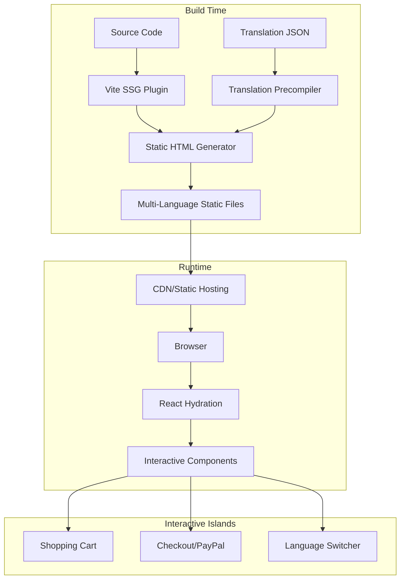
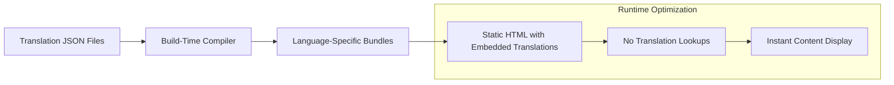

# Design Document: Vite SSG Optimization

## Overview

This design document outlines the technical architecture for optimizing the current React + Vite application through Static Site Generation (SSG), pre-built translations, and multi-language routing. The solution maintains the existing React ecosystem while achieving significant performance and SEO improvements through build-time optimizations.

The core strategy involves transforming the current Single Page Application (SPA) into a hybrid architecture where pages are pre-rendered as static HTML at build time, then hydrated with React for interactivity. This approach provides the SEO benefits of static sites while preserving the dynamic functionality required for e-commerce operations.

## Architecture

### High-Level Architecture



### Translation Architecture



### Routing Architecture

```mermaid
graph TB
    A[Root Domain] --> B{Language Detection}
    B --> C[/en/ Routes]
    B --> D[/es/ Routes]
    B --> E[/fr/ Routes]
    B --> F[... 14 more languages]
    
    C --> G[Static HTML Files]
    D --> G
    E --> G
    F --> G
```

## Components and Interfaces

### 1. SSG Build System

**ViteSSGConfig Interface:**
```typescript
interface ViteSSGConfig {
  routes: RouteConfig[];
  languages: Language[];
  translationPath: string;
  outputDir: string;
  seoConfig: SEOConfig;
}

interface RouteConfig {
  path: string;
  component: string;
  generateStaticParams?: () => Promise<StaticParam[]>;
}
```

**Responsibilities:**
- Generate static HTML for all routes and languages
- Integrate with existing Vite build pipeline
- Preserve React component functionality
- Handle dynamic route generation

### 2. Translation Precompiler

**TranslationCompiler Interface:**
```typescript
interface TranslationCompiler {
  compileTranslations(languages: Language[]): CompiledTranslations;
  validateTranslationKeys(translations: TranslationDict[]): ValidationResult;
  generateLanguageRoutes(baseRoutes: Route[]): LanguageRoute[];
}

interface CompiledTranslations {
  [language: string]: {
    [key: string]: string;
  };
}
```

**Responsibilities:**
- Process translation JSON files at build time
- Generate optimized translation bundles
- Validate translation completeness
- Embed translations directly into HTML

### 3. Multi-Language Router

**LanguageRouter Interface:**
```typescript
interface LanguageRouter {
  detectLanguage(request: Request): Language;
  generateLanguageRoutes(baseRoute: string): LanguageRoute[];
  handleLanguageSwitch(newLanguage: Language): void;
}

interface LanguageRoute {
  path: string;
  language: Language;
  staticPath: string;
}
```

**Responsibilities:**
- Generate language-specific routes
- Handle language detection and switching
- Maintain URL structure consistency
- Support client-side navigation

### 4. SEO Optimization Engine

**SEOEngine Interface:**
```typescript
interface SEOEngine {
  generateMetaTags(page: PageData, language: Language): MetaTags;
  createSitemap(routes: LanguageRoute[]): Sitemap;
  generateStructuredData(content: ContentData): StructuredData;
}

interface MetaTags {
  title: string;
  description: string;
  canonical: string;
  hreflang: HreflangTag[];
  openGraph: OpenGraphData;
}
```

**Responsibilities:**
- Generate comprehensive meta tags for each page/language
- Create XML sitemaps for all language variants
- Embed structured data markup
- Handle canonical URLs and hreflang tags

### 5. Hydration Manager

**HydrationManager Interface:**
```typescript
interface HydrationManager {
  hydrateComponent(element: HTMLElement, component: ReactComponent): void;
  preserveState(stateKey: string, state: any): void;
  restoreState(stateKey: string): any;
}
```

**Responsibilities:**
- Selectively hydrate interactive components
- Preserve application state during hydration
- Maintain PayPal integration functionality
- Handle progressive enhancement

## Data Models

### Translation Data Model

```typescript
interface TranslationData {
  languages: Language[];
  translations: {
    [language: string]: TranslationDict;
  };
  metadata: TranslationMetadata;
}

interface TranslationDict {
  [key: string]: string | TranslationDict;
}

interface TranslationMetadata {
  version: string;
  lastUpdated: Date;
  completeness: {
    [language: string]: number; // percentage
  };
}
```

### Route Data Model

```typescript
interface RouteData {
  path: string;
  component: string;
  languages: Language[];
  seoData: SEOData;
  staticParams?: StaticParam[];
}

interface SEOData {
  title: TranslatableString;
  description: TranslatableString;
  keywords: string[];
  structuredData?: StructuredDataType;
}

interface StaticParam {
  [key: string]: string | number;
}
```

### Build Output Model

```typescript
interface BuildOutput {
  staticFiles: StaticFile[];
  assets: AssetFile[];
  sitemaps: SitemapFile[];
  redirects: RedirectRule[];
}

interface StaticFile {
  path: string;
  language: Language;
  content: string;
  metadata: FileMetadata;
}
```

## Correctness Properties

*A property is a characteristic or behavior that should hold true across all valid executions of a system-essentially, a formal statement about what the system should do. Properties serve as the bridge between human-readable specifications and machine-verifiable correctness guarantees.*

### Property 1: Static HTML Generation Completeness
*For any* page route and supported language combination, the build process should generate a corresponding static HTML file with complete content.
**Validates: Requirements 1.1, 2.2**

### Property 2: Translation Embedding Consistency
*For any* generated static HTML file, all translation keys should be resolved and embedded directly in the HTML content without requiring runtime lookups.
**Validates: Requirements 3.2, 3.3**

### Property 3: Language Route Structure Integrity
*For any* base route, the system should generate exactly 17 language-specific routes following the pattern `/{language-code}/path` for each supported language.
**Validates: Requirements 2.1, 2.3**

### Property 4: SEO Metadata Completeness
*For any* generated static page, the HTML should contain complete meta tags including title, description, canonical URL, and hreflang tags for all language variants.
**Validates: Requirements 4.1, 4.2**

### Property 5: Performance Benchmark Achievement
*For any* generated static page, Lighthouse performance audits should achieve scores above 90 for performance, accessibility, and SEO metrics.
**Validates: Requirements 5.2, 5.3**

### Property 6: Interactive Component Preservation
*For any* interactive component (shopping cart, checkout, PayPal integration), the functionality should work identically before and after the SSG optimization.
**Validates: Requirements 6.1, 6.2, 6.3**

### Property 7: Build Output Consistency
*For any* build execution, the system should generate all expected language variants, static assets, and configuration files without missing dependencies.
**Validates: Requirements 7.2, 7.3**

### Property 8: Language Detection Accuracy
*For any* browser language preference setting, the system should correctly detect and redirect users to the appropriate language variant.
**Validates: Requirements 8.1, 8.2**

### Property 9: Translation Validation Completeness
*For any* set of translation files, the validation system should identify all missing translation keys and report completeness percentages accurately.
**Validates: Requirements 9.3**

### Property 10: Deployment Compatibility
*For any* generated static file, it should be servable by standard CDN infrastructure without requiring server-side processing.
**Validates: Requirements 10.1, 10.2**

### Property 11: URL Compatibility Preservation
*For any* existing URL in the current system, there should be appropriate redirects to maintain backward compatibility after implementing the new routing structure.
**Validates: Requirements 12.2**

### Property 12: Hydration State Consistency
*For any* component that requires hydration, the client-side state should match the server-rendered state to prevent hydration mismatches.
**Validates: Requirements 1.3, 6.1**

## Error Handling

### Build-Time Error Handling

1. **Translation Validation Errors**
   - Missing translation keys detection
   - Incomplete language coverage warnings
   - Malformed JSON file handling
   - Graceful degradation to English fallbacks

2. **Route Generation Errors**
   - Invalid route configuration detection
   - Duplicate route path resolution
   - Missing component file handling
   - Dynamic route parameter validation

3. **Asset Processing Errors**
   - Image optimization failure handling
   - CSS/JS bundling error recovery
   - Font loading error management
   - Third-party dependency resolution

### Runtime Error Handling

1. **Hydration Errors**
   - Component hydration failure recovery
   - State mismatch resolution
   - Progressive enhancement fallbacks
   - Error boundary implementation

2. **Language Switching Errors**
   - Invalid language code handling
   - Missing translation fallbacks
   - Route navigation error recovery
   - Browser compatibility issues

3. **Performance Monitoring**
   - Core Web Vitals tracking
   - Error rate monitoring
   - Performance regression detection
   - User experience metrics

## Testing Strategy

### Build-Time Testing

**Static Generation Tests:**
- Verify HTML generation for all routes and languages
- Validate translation embedding completeness
- Test SEO metadata presence and accuracy
- Confirm asset optimization and bundling

**Translation System Tests:**
- Test translation key validation
- Verify language completeness checking
- Test fallback mechanism functionality
- Validate JSON structure integrity

### Runtime Testing

**Hydration Tests:**
- Test component hydration success
- Verify state preservation during hydration
- Test interactive functionality post-hydration
- Validate PayPal integration preservation

**Performance Tests:**
- Lighthouse audit automation
- Core Web Vitals measurement
- Load time benchmarking across languages
- Bundle size optimization verification

**Integration Tests:**
- End-to-end checkout process testing
- Language switching functionality
- SEO crawler simulation
- Cross-browser compatibility testing

### Property-Based Testing Configuration

Each property test should run a minimum of 100 iterations to ensure comprehensive coverage. Tests will be tagged with the format: **Feature: vite-ssg-optimization, Property {number}: {property_text}**

**Testing Framework:** Vitest with custom property testing utilities
**Coverage Target:** 90% code coverage for build-time logic, 85% for runtime hydration
**Performance Baseline:** Current site metrics as minimum acceptable performance